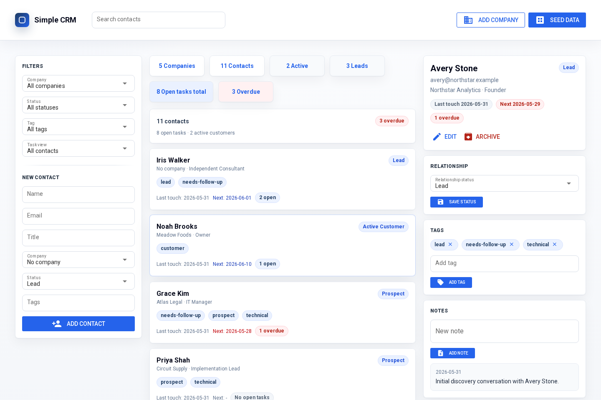

# Simple CRM

Simple CRM is a small tutorial app for building a persistent Python internal
tool with dbzero and NiceGUI.

The current implementation contains the durable CRM domain model, sample data,
tests, and a compact NiceGUI interface.



## What The App Does

Simple CRM tracks companies, contacts, notes, tags, and follow-up tasks. It is
small on purpose: the goal is to show how a useful internal tool can keep
durable state with Python objects instead of adding a frontend build, REST API,
ORM, cache service, migration framework, or separate database server.

The core workflow is:

1. Add a company and contact.
2. Record a note from a conversation.
3. Create a dated follow-up task.
4. See the contact in open-task or overdue-task views.
5. Complete or reopen the task.
6. Restart the app and keep the CRM history.

## Setup And Run

```bash
python -m pip install -e ".[dev]"
python -m pytest -q
python app.py --host 0.0.0.0 --port 8081
```

Open `http://localhost:8081`, then use **Seed data** to populate example
companies, contacts, notes, and tasks.

## Files To Inspect First

- `app.py`: NiceGUI entrypoint and UI event handlers.
- `simple_crm/models.py`: durable CRM objects and workflow methods.
- `simple_crm/seed.py`: idempotent sample data.
- `tests/`: domain, app startup, and browser smoke coverage.

## Durable Root And Persistence

The root object is `CRM` in `simple_crm/models.py`. It is decorated as the only
dbzero singleton root, and all durable app state is reachable from it:

- companies
- contacts
- lookup dictionaries
- date/datetime indexes

The app opens dbzero in `app.py` with:

```python
db0.init(".dbzero", prefix="/dbzero/simple-crm/dev/data", autocommit=True)
crm = CRM()
```

With `autocommit=True`, normal CRM updates persist automatically as they happen.
There is no save or checkpoint button: adding contacts, notes, tasks, tags, and
status changes writes through to the local dbzero store.

Local durable app data lives under `.dbzero/`. Restarting the app reopens that
state. To reset local app state, stop the app and remove that directory:

```bash
rm -rf .dbzero
```

Tests use temporary dbzero roots, so they do not read or modify local app data.

## What Works

- Add companies and contacts.
- Seed sample CRM data.
- Filter contacts by company, status, tag, open tasks, overdue tasks, and text.
- Add notes and follow-up tasks.
- Complete and reopen tasks.
- Archive contacts.

## Seed Data

The **Seed data** button creates five companies and twelve contacts with mixed
statuses, tags, notes, open tasks, completed tasks, and overdue tasks. The seed
operation is idempotent by sample contact email: pressing the button again
reuses existing records instead of duplicating the demo CRM.

## Stack Comparison

| Common internal-tool layer | Simple CRM tutorial |
| --- | --- |
| React/Vue/Svelte frontend | NiceGUI components in Python |
| REST API routes | NiceGUI event handlers |
| Request/response DTOs | Direct Python method calls |
| ORM models and query builders | dbzero-backed Python objects, references, dict lookups, and indexes |
| Database server | Embedded `.dbzero/` state |
| Manual cache layer | dbzero caching behavior |
| Separate audit subsystem | Not included in the main tutorial workflow |

This stack is useful beyond toy demos and small prototypes. For many
Python-first internal tools, dashboards, operations apps, workflow trackers, and
stateful team utilities, NiceGUI plus dbzero can replace much of the classic
frontend/API/ORM/database-server stack with direct Python objects and a compact
browser UI.

That smaller surface area is also a practical advantage for AI coding agents:
there are fewer layers to coordinate, fewer generated interfaces to keep in
sync, and more of the application behavior is visible in ordinary Python code.

It is still not universal. Explicit APIs, relational databases, separate
frontends, external queues, and deployment automation remain appropriate when
the product needs their boundaries, scale characteristics, integrations, or
operational controls.

## Browser Verification

The test suite includes a Playwright smoke test that starts the app with an
isolated temporary `.dbzero` root, seeds sample data, opens a contact, adds a
note and task, and completes/reopens the task.

Run it with the rest of the suite:

```bash
python -m pytest -q
```

If Chromium system libraries are missing, pytest skips only the browser test and
reports the missing dependency.
